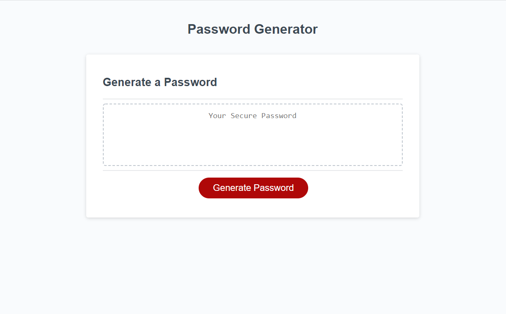
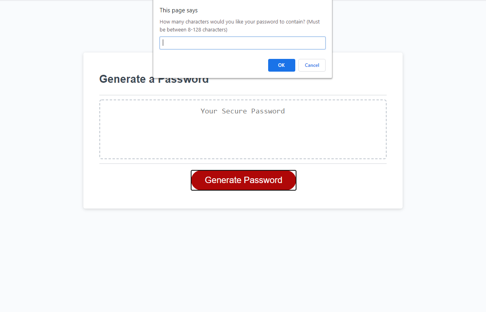
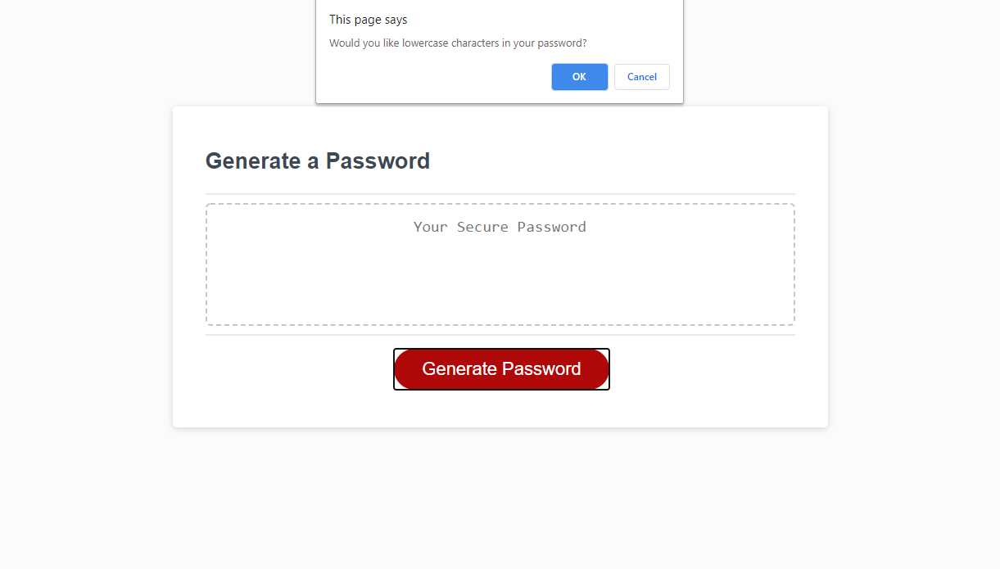
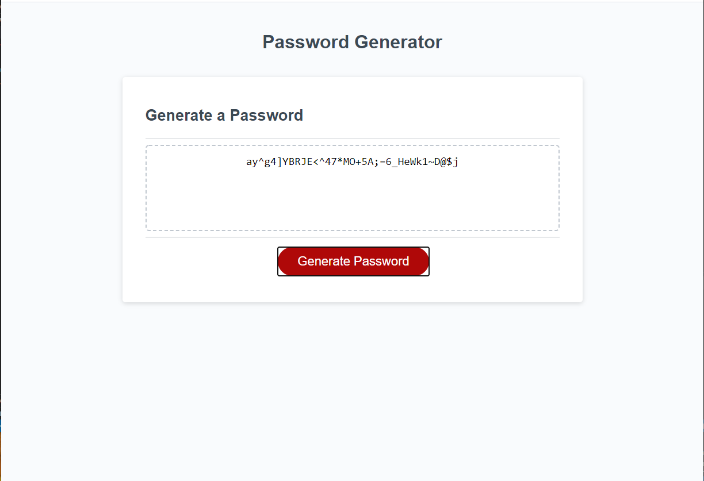

# Javascript-Password-Generator

Description

This assignment required me to create an application that an employee can use to generate a random password based on criteria they’ve selected by modifying starter code. This app will run in the browser, and will feature dynamically updated HTML and CSS powered by JavaScript code that I wrote. It has a clean and polished user interface that is responsive, ensuring that it adapts to multiple screen sizes.

For me, there were three main parts of this project. First, I created all the priliminary aspects of the Javascript code. I defined all of my variables and create four arrays from which to pull from later in the code to create the randomly generated password. Second, I created the function which would house the creation of the password and created all the prompts that would allow the user to select the length of their password and what characters they would like to include. These options were Uppercase, Lowercase, Numbers, and Special Characters. If any option was choosen outside of these parameters, appropriate messages were created to notify the user and allow them to try again. The third and most challenging part of this project was creating the "While Loop" that would create the randomly generated password based the parameters choosen by the user. I had great difficultly in creating this Loop, but eventually found a method that I think works very well. By assigning an integer between 1-4 to each parameter, I created a variable that picks one of these numbers at random. Once the random number is choosen, the while loop will run through each "If statement" until it has reached the parameter that is assigned to this number. If the user has choosen this parameter to be part of their password, another variable will select a random character from that assigned array. The selection is then saved in the "concat() method". Each time it runs through this process, the Password length is subtracted by one so that the number of characters is equal to length choosen by the user. 

Installation

None required, just follow link https://julieanni.github.io/Javascript-Password-Generator/

Usage

The purpose of the project is to take existing HTML and CSS files and add a functioning Javascript file that follows the critera of the client. The first photo displays the existing HTML and CSS file I had to work with. The second displays the prompt desired by the client to choose the length of your password between 8-128 characters by entering the desired length in the text box. If a length is choosen outside of those parameters, an alert will pop-up stating this issue and the user will return to homescreen. Once the length is selected, four more prompts will follow asking the user what parameters they desire for the password. An example of this is shown in the third image below. These parameters are whether the user wants lowercase, uppercase, numeric, or special characters in their password. They can choose any of these options, however, if they select none of these parameters, an alert will notify them that they must select at least one and they will be returned to the homepage. Once these parameters are selected, the randomly generated password will be displayed on the page in the text box. An example of this can be seen in the fourth image. 

Credits
Thank you to my instructor and TA's who helped answer questions and taught me how to make this project possible. Completing this project would not have been possible without guidance from my father, a fellow Programmer, who helped me break down the function of actually creating the random password into smaller steps.  

License
MIT License 

Copyright (c) 2020 JulieAnnI

Permission is hereby granted, free of charge, to any person obtaining a copy
of this software and associated documentation files (the "Software"), to deal
in the Software without restriction, including without limitation the rights
to use, copy, modify, merge, publish, distribute, sublicense, and/or sell
copies of the Software, and to permit persons to whom the Software is
furnished to do so, subject to the following conditions:

The above copyright notice and this permission notice shall be included in all
copies or substantial portions of the Software.

THE SOFTWARE IS PROVIDED "AS IS", WITHOUT WARRANTY OF ANY KIND, EXPRESS OR
IMPLIED, INCLUDING BUT NOT LIMITED TO THE WARRANTIES OF MERCHANTABILITY,
FITNESS FOR A PARTICULAR PURPOSE AND NONINFRINGEMENT. IN NO EVENT SHALL THE
AUTHORS OR COPYRIGHT HOLDERS BE LIABLE FOR ANY CLAIM, DAMAGES OR OTHER
LIABILITY, WHETHER IN AN ACTION OF CONTRACT, TORT OR OTHERWISE, ARISING FROM,
OUT OF OR IN CONNECTION WITH THE SOFTWARE OR THE USE OR OTHER DEALINGS IN THE
SOFTWARE.